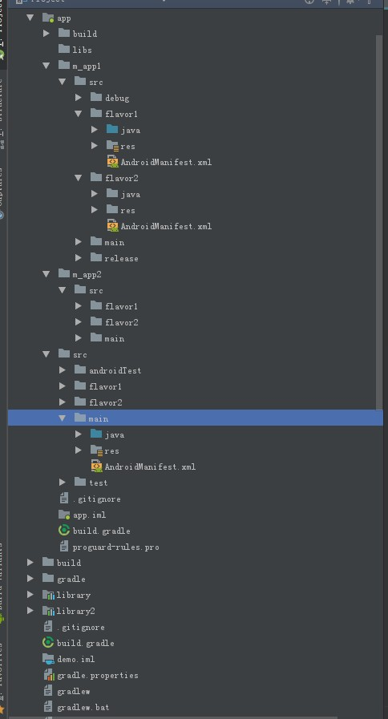

[  ](https://bintray.com/act262/maven/pin-plugin/_latestVersion)

#### FEATURES
- [x] 原始代码结构，include kotlin
- [x] module下分模块放置代码， 支持`AndroidManifest`下的节点自动合并
- [x] 支持多productFlavor组合的源码结构 
- [x] 自定义模块匹配配置规则
- [ ] 代码边界控制
- [ ] 模块内嵌模块

### 使用
**使用环境 `Android gradle plugin 3.1.1`, `gradle 4.4`,`AndroidStudio 3.+`**

#### 在项目根`build.gradle`下配置
```groovy
buildscript {
    repositories {
        jcenter()
    }
    dependencies {
        // ...
        classpath 'com.jfz.plugin:pin-plugin:<latest-version>'
    }
}
```

在Android项目的build.gradle中生效插件
```groovy
// application
apply plugin: 'com.android.application'
// or library
apply plugin: 'com.android.library'

apply plugin: 'com.jfz.plugin.pin'
```

如果需要全部项目生效,需要在根build.gradle中`afterEvaluate`配置
```groovy
subprojects {
    afterEvaluate {
        it.apply plugin: 'com.jfz.plugin.pin'
    }
}
```

#### 修改Android代码结构

然后代码结构参考demo上的结构即可

> 当前默认匹配以`m_`,`p_`,`c_`前缀的目录作为模块目录

---


### 最后项目结构如图
 