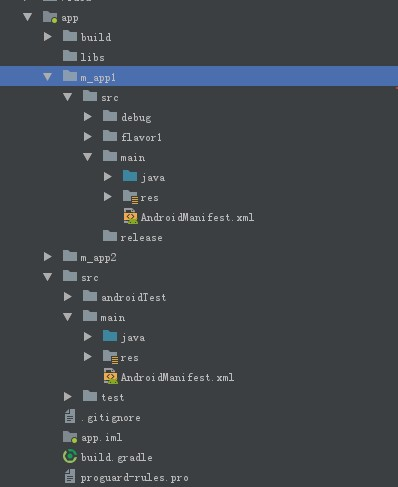

### pin模式
起初看到微信架构的演进里提到`pin`模式，就是把各个模块代码单独出来。为什么不用module来做？因为module多了以后编译速度就很慢了，所以微信利用sourceSets这个属性把不同模块下的代码组织起来，相当于还是只有一个module，编译速度不受影响。

### 实现
gradle 默认配置中可以对源码位置配置修改
```groovy

android{
    // ...
    
    def dir = "xxx/yyy"
    sourceSets {

        main {
            assets.srcDirs "${dir}/assets"
            java.srcDirs "${dir}/java"
            res.srcDirs "${dir}/res"
            aidl.srcDirs "${dir}/aidl"
            manifest.srcFile "$dir/AndroidManifest.xml"
        }
    }
}
```

但是每个sourceSets只能设置一个AndroidManifest文件，为了能够实现把AndroidManifest文件也可以像其他资源分散到具体目录下，就需要手动把这些合并起来。

#### AndroidManifest合并
 一开始想到的是在sourceSets里面把指定的AndroidManifest文件hack进去，
 `ManifestProcessorTask`
 `MergeManifests`
 `ProcessManifest`
 
 操作下来还是不行，
 
 最后参考了AndroidManifest文件合并的代码实现(`ManifestMerger2`)。
 
 最后项目结构如图
 